- 🔭 I’m currently learning frontend web design.
- 🌱 I love ricing linux.
- 📫 How to reach me: Discord: sortedcord#0716
- 😄 Pronouns: he/him
- ⚡ Fun fact: a = b

# Metrics

*NOTE: Top languages does not indicate my skill level or something like that, it's a github metric of which languages i have the most code on github.

<a href="https://github.com/anuraghazra/github-readme-stats">
  <!-- Change the `github-readme-stats.anuraghazra1.vercel.app` to `github-readme-stats.vercel.app`  -->
  
</a>

# Dot Repositories

| <a href="https://github.com/anuraghazra/github-readme-stats">   <!-- Change the `github-readme-stats.anuraghazra1.vercel.app` to `github-readme-stats.vercel.app`  -->    </a> | <a href="https://github.com/anuraghazra/github-readme-stats">   <!-- Change the `github-readme-stats.anuraghazra1.vercel.app` to `github-readme-stats.vercel.app`  -->    </a> |
|-------------------------------------------------------------------------------------------------------------------------------------------------------------------------------------------------------------------------------------------------------------------------------------------------------------------------------|---------------------------------------------------------------------------------------------------------------------------------------------------------------------------------------------------------------------------------------------------------------------------------------------------------------------|
| <a href="https://github.com/anuraghazra/github-readme-stats">   <!-- Change the `github-readme-stats.anuraghazra1.vercel.app` to `github-readme-stats.vercel.app`  -->    </a>     |                                                                                                                                                                                                                                                                                                                     |
